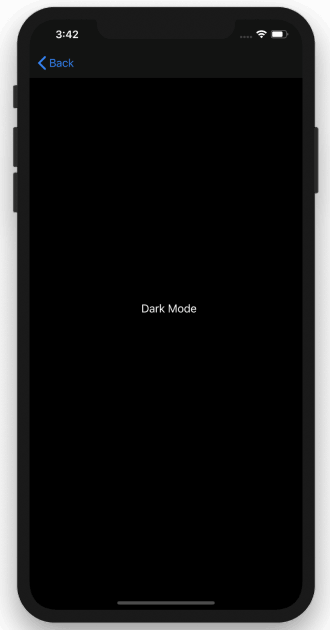

# ios-darkmode
👺👺 ios dark mode is theme dark for ios phone. When we set up general setting into dark mode then app will be change into dark theme. 
Otherwise when we set into lihgt mode the app will be change into light mode

# Screnshoot

* **Faridho** - [Medium](https://medium.com/@faridho)
